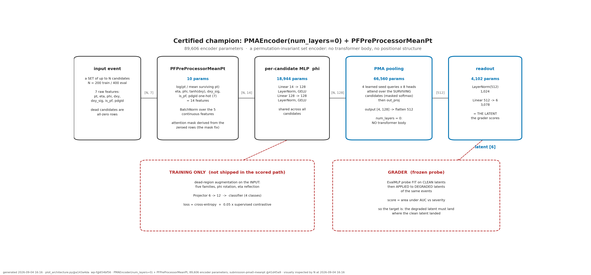

# Robust Tagging (Fast ML 2026, Challenge C9) — team hand-over

This repository holds our submission, the evidence behind it, the tooling that produced the evidence, and the record of two
overnight campaigns. Everything a teammate needs to reproduce, re-verify or continue the work is here or pointed to from here.

## What we submit




**Model:** an attention-pooled set encoder (`PMAEncoder`, `num_layers: 0`): a per-candidate MLP (14 → 128 → 128, LayerNorm, GELU),
pooling by multi-head attention over four learned seed queries, LayerNorm, a linear head to a 6-d latent. 89,606 parameters.
**Preprocessor:** `PFPreProcessorMeanPt` (each candidate's pt normalised by the mean surviving pt instead of the sum).
**Training:** 25 epochs, batch 256, on `robust_tagging_train_data_small.pt`, against a broad simulated dead-region generator
(five shape families, exact φ rotation and η reflection, curriculum warm-up).

| benchmark | ours | reference |
|---|---|---|
| organisers' `eval.py`, eight independent runs | 0.8774 – 0.8805 | organisers' stock checkpoint 0.8201 |
| our five-family development bench, three training seeds | 0.8262 ± 0.0030 | stock checkpoint 0.7734 |
| held-out corruption shapes (never trained on) | 0.802 | |
| Group 3's corruption suite, like for like (same training file, same eval file, one probe) | 0.8270 | their best 0.8107 |

The shipped commit is the branch `submission-pma0-meanpt` at `41d45a9` (this branch adds documentation on top of it; the code,
config and checkpoint are byte-identical). `docs/SUBMISSION-HANDOVER.md` lists the checkpoint's sha256 and every official measurement.

## Evaluate any of our models

`models/MODELS.md` indexes the best checkpoint of every model we trained, each in its own directory with the checkpoint (or a pointer to the
branch that ships it), the exact train config, `BUILD.md` (code commit, encoder and preprocessor classes, alias if any) and `evaluate.sh`,
which runs the organisers' `eval.py` from a fresh clone of the right branch and our bench with the right classes. Models: the champion,
the Deep Sets runner-up, the transformer-body variant (a-pma), the champion with the stock preprocessor, the champion recipe trained on
the L1T file, the HGQ2 quantized operating point (L1T), and the two campaign-2 candidates (latent 32; one block with a 256-wide feed-forward).

## Run the grader on the submission

```bash
git clone <this repo> robust-tagging && cd robust-tagging
pip install -e .                                   # or use the organisers' environment
python eval.py --data_cfg configs/data_config_eval.yaml \
               --train_cfg configs/train_config.yaml \
               --encoder checkpoints/rt_d_pma0_aug_meanpt_encoder_20260903_221125.pth \
               --data ~/hack-data/C9_robust_tagging/eval/robust_tagging_eval_small.pt --outdir eval_plots
```
`eval.py` constructs the encoder under the grader's class name; `src/embedding/models.py` aliases `TransformerEncoder` to `PMAEncoder`,
and `num_layers: 0` is both the config value and the class default, so the shipped config alone rebuilds the model.
The grader's probe is unseeded: one run of `eval.py` varies by about ±0.002; never quote a single run as exact.

## Reproduce the training

```bash
git checkout wp-d            # training branch (commit 9801bdd); or integration-2 for the campaign-2 tooling
python train.py --data_cfg configs/data_config_collide1m_small.yaml \
                --train_cfg configs/train_config_d_pma0_aug_meanpt.yaml \
                --data ~/hack-data/C9_robust_tagging/train/robust_tagging_train_data_small.pt --outdir checkpoints
```
About 10 minutes on one A10. Expect mean_area between 0.824 and 0.830 on the development bench: the training-seed spread of this recipe
is 0.0030 (measured on three seeds in each of two data regimes), roughly ten times the probe noise.

## Measure a model the way we did

`tooling/bench/bench_eval.py` is the ruler: five seeded corruption families on 20k eval events, five probe refits, mean ± std.
```bash
python tooling/bench/bench_eval.py --repo <clone> --ckpt <checkpoint> --tag <name> \
       --encoder_class PMAEncoder --train_cfg <the config the checkpoint was trained with> --probe_repeats 5
```
Add `--families heldout` (our held-out shapes), `--families colleague` (Group 3's suite, `c_` prefix), `--data ..._l1t.pt --eta_max 3.0`
(the L1T acceptance), `--train_data <basename>` and `--seed` so the row is fully described. `tooling/bench/suite_run.sh` runs all suites;
`tooling/bench/ablation_table.py` builds `docs/table.md` with the seed test; `tooling/bench/accept.sh --submission` is the fresh-clone
certification.

**The standard that decides anything:** three training seeds per configuration; two configurations are separable only when the gap
between their seed means exceeds 3·sqrt(s_a²/3 + s_b²/3). With s = 0.0030 that bar is about 0.0074. Single-run gaps below ~0.006 are
unproven. Every number in a report is read from its `runs/*.json` in the command that writes the report.

## What we learned (short form; full record in `docs/`)

- Deriving the attention mask from the zeroed input rows is worth +0.018 on frozen stock weights and +0.035 after retraining.
- Pooled set encoders beat a retrained masked transformer; the transformer body adds nothing measurable at 27x the parameters.
- Normalising pt by the surviving sum injects a severity-correlated shift; mean-pt removes 95% of the resulting latent drift.
- The training-seed spread (0.0030) is the binding noise, not probe refits (0.0004) and not the bench (0.00009). It is a property of the
  training procedure, not the data size. Repeat seeds, never benches.
- Twelve times the training data (940k events × 400 candidates) changes the robustness metric by 0.0000 (three seeds each regime).
- Encoder capacity is not binding (3.8x parameters lands on the reference); the probe uses latent magnitude (normalising the latent costs
  0.026); whitened consistency collapses the latent; the two-view latent shrink is the MSE term's doing.
- Checkpoint selection under an unseeded validation corruption was noise-dominated; seed it (`val_degradation_seed`).
- The generator effectively never removed more than 70% of an event's candidates; a third of that was calibration error in our own
  families; fixing both did not move the score.
- Group 3's published numbers came from a different probe and severity grid; on one instrument our recipe leads on every family.
- FPGA line (HGQ2 + hls4ml): 6-bit weights with ReLU costs nothing beyond the LayerNorm→BatchNorm swap (−0.004); the folded 400-candidate
  design compiles and is bit-exact; fitting configuration 34,048 multipliers; Vitis HLS could not finish synthesis here (tail quantizers).

## Figures

- `docs/plots/architecture_latest.png` — the champion, end to end.
- `docs/plots/curves_latest.png` — AUC vs severity per corruption family, every model, on our development bench.
- `docs/plots/tsne_latents_latest.png` — t-SNE of the 6-d latent, 6,000 eval events, winner vs organisers' stock model, clean and under cell dropout at severities 0.4 and 0.8 (one joint embedding per row, so movement between panels is real).
- `docs/plots/tsne_drift_latest.png` — where each event's latent moves under cell dropout at severity 0.8 (descriptive: neither coherence nor the along-probe fraction explains the ranking).
- `docs/plots/seeds_latest.png` — every campaign-2 configuration's seeds against the champion's seed band: the ruling figure.
- `docs/plots/colleague_latest.png`, `l1t_colleague_latest.png`, `colleague_group3_latest.png` — Group 3's corruption suite: our models; the like-for-like comparison against their checkpoints; the preserved PF-file comparison.
- `docs/plots/heldout_latest.png`, `official_latest.png`, `altdata_latest.png`, `quant_curve_latest.png`, `augmentation_examples_latest.png` — held-out shapes, the organisers' grader, the L1T acceptance, accuracy vs bit width, and what the training augmentation does to an event.
- `docs/plots/README.md` — the inspection record of every figure and the register of 41 silent-failure classes.

## Where things are

`docs/writeup/` per-package sections (A–N, G) · `docs/RULING.md`, `docs/RULING-2.md` the decisions and why · `docs/table.md` every measured
row · `docs/plots/` the figures and the register of 41 silent-failure classes (`docs/plots/README.md`) · `docs/reports/` the hour-by-hour
reports · `docs/prompts/` the briefs and the rulings log · `docs/CHECKPOINTS.md` every checkpoint with sha256 and location ·
`tooling/` the bench, the acceptance script and the GPU slot scheduler.

For an agent picking this up, read `AGENTS.md` first.
